# Azure Microsoft Defender for Endpoint Lab

## Project Overview

This lab focused on identity and access management, least privilege, endpoint security, and SOC-style alert investigation in a Microsoft Azure environment.

I created test employee accounts in Microsoft Entra ID, assigned role-based permissions, deployed and monitored a Windows Server virtual machine, onboarded the endpoint to Microsoft Defender for Endpoint, simulated suspicious PowerShell activity, investigated the resulting security alert, used Live Response for remote endpoint investigation, and analyzed failed authentication activity with KQL.

---

## Technologies Used

- Microsoft Azure
- Microsoft Entra ID
- Azure Role-Based Access Control (RBAC)
- Windows Server 2022
- Microsoft Defender for Endpoint
- Microsoft Defender for Cloud
- PowerShell
- Remote Desktop Protocol (RDP)
- Microsoft Defender Live Response
- Azure Log Analytics
- Kusto Query Language (KQL)

---

## 1. Identity and Access Management

Created test employee accounts in Microsoft Entra ID to simulate users with different responsibilities within an organization.

The accounts included:

- David Developer
- Hannah HR
- Sarah Security

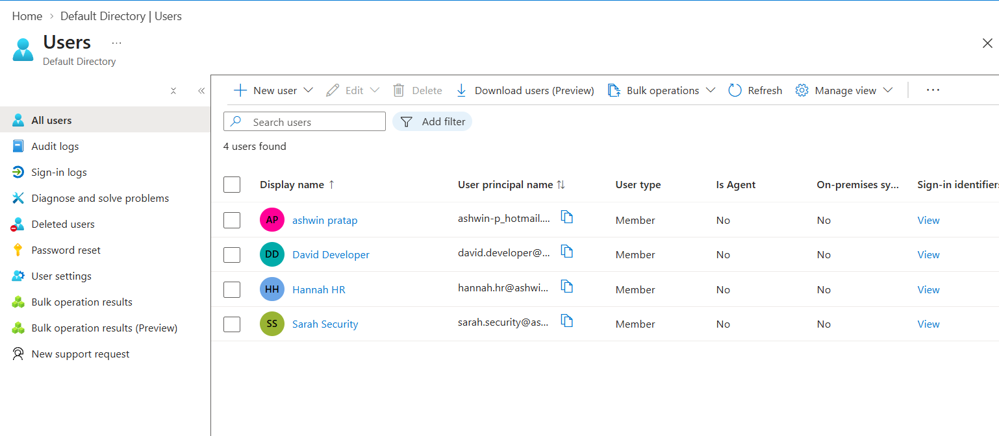

---

## 2. Least-Privilege RBAC

Assigned Azure roles based on each user's job responsibilities:

- David Developer — Contributor
- Hannah HR — Reader
- Sarah Security — Security Reader

This demonstrated the principle of least privilege by ensuring users only received the permissions necessary to perform their responsibilities.

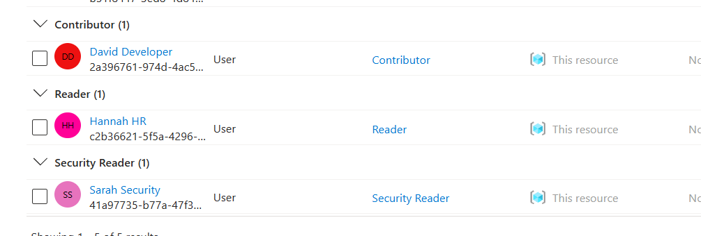

---

## 3. Security Role Assignment

Assigned the Security Operator role to the Sarah Security account.

This role allows a security-focused user to work with security events without providing unnecessary administrative permissions.

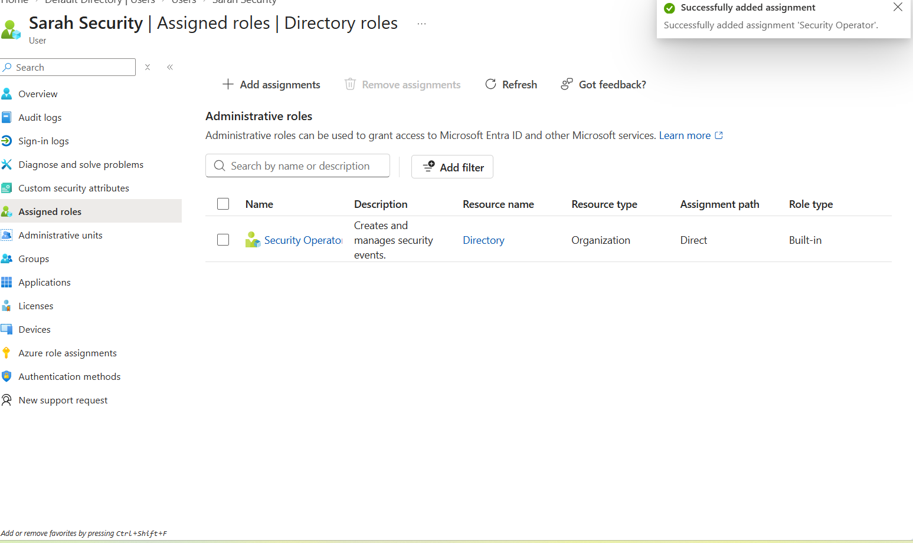

---

## 4. Azure Windows Server Deployment

Deployed a Windows Server virtual machine in Microsoft Azure to act as the endpoint for the security monitoring portion of the lab.

I called the Windows Server virtual machine mywindowslabserver

The server was used for Microsoft Defender for Endpoint onboarding, attack simulation, security monitoring, and investigation.

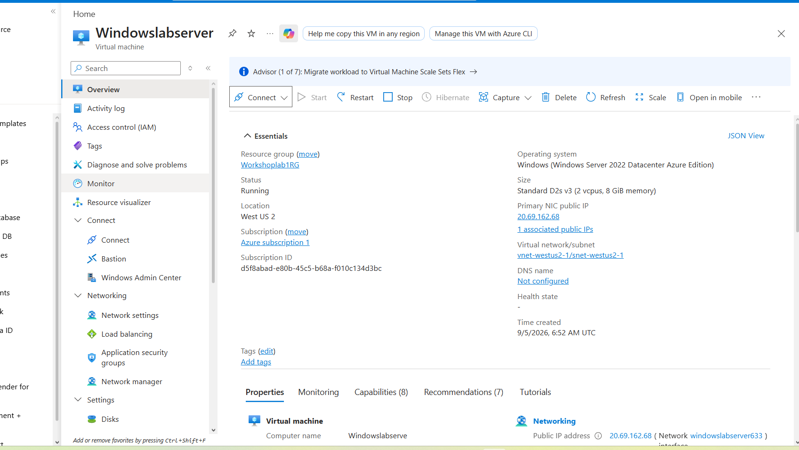

---

## 5. Microsoft Defender for Endpoint Onboarding

Verified that Microsoft Defender for Endpoint was running on the Windows Server.

PowerShell was used to confirm that the Microsoft Defender Advanced Threat Protection service was running and that the device had successfully completed the onboarding process.

The onboarding status returned:

- `Sense: Running`
- `OnboardingState: 1`

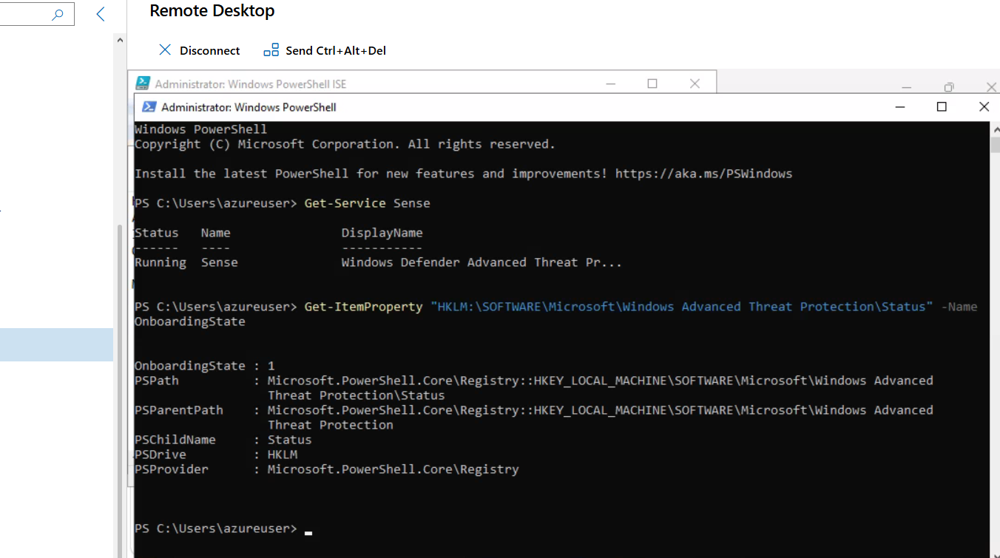

---

## 6. Controlled PowerShell Attack Simulation

Connected to the Windows Server through Remote Desktop and executed a controlled PowerShell attack simulation.

The script was intentionally run in the lab environment to generate suspicious endpoint behavior that Microsoft Defender for Endpoint could detect.

Command used:

`& "C:\Users\azureuser\Downloads\AttackScript.ps1"`

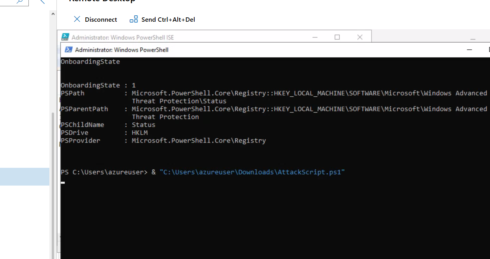

### Shellcode Injection Result

After the attack simulation executed, the lab displayed a message indicating that shellcode had been injected into a process.

This confirmed that the controlled simulation generated suspicious behavior for Microsoft Defender for Endpoint to detect.

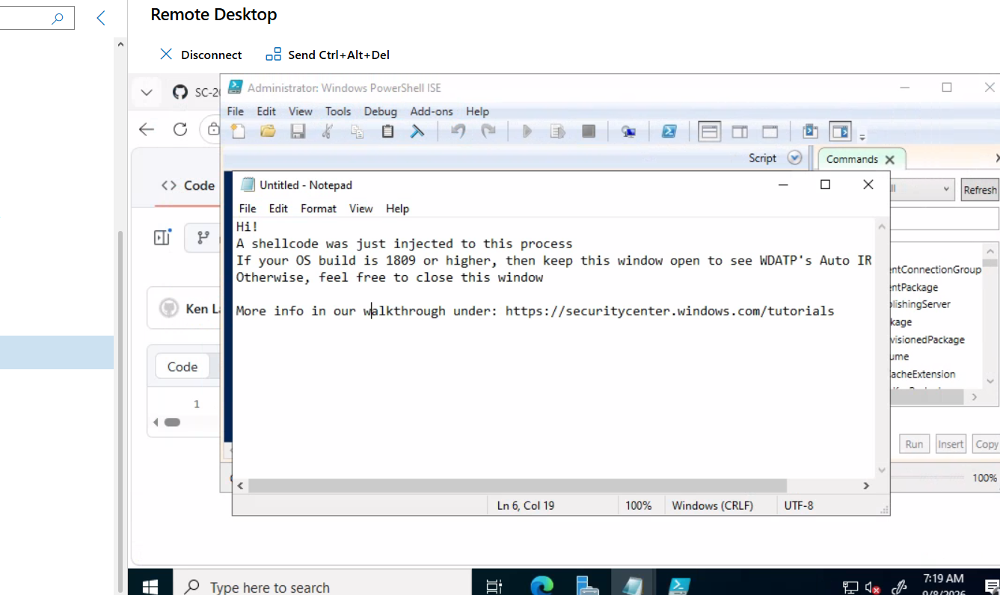

### Attack Technique Analysis

I reviewed the PowerShell attack script to understand how the simulated activity worked.

The script demonstrated:

- Base64 decoding using `FromBase64String`
- XOR decoding using the `-bxor` operator
- Reconstruction of decoded content in memory
- Execution using `Invoke-Expression`

This helped me understand the techniques behind the simulated PowerShell activity instead of only executing the script.

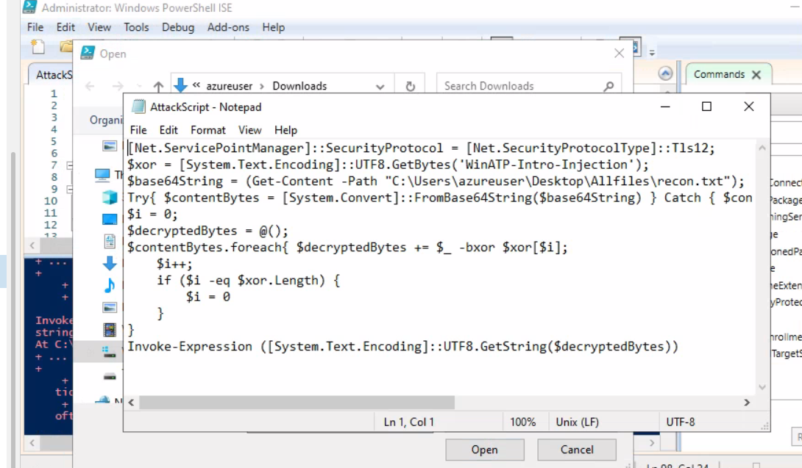

---

## 7. Microsoft Defender Alert Investigation

Microsoft Defender for Endpoint generated a Medium-severity alert after detecting abnormal process behavior on the Windows Server.

I reviewed the alert details and process tree to understand the chain of execution and determine why the behavior was considered suspicious.

The investigation included reviewing:

- Alert severity
- Affected endpoint
- Logged-on user
- Process relationships
- Suspicious process behavior
- Parent and child processes
- Activity associated with the PowerShell simulation

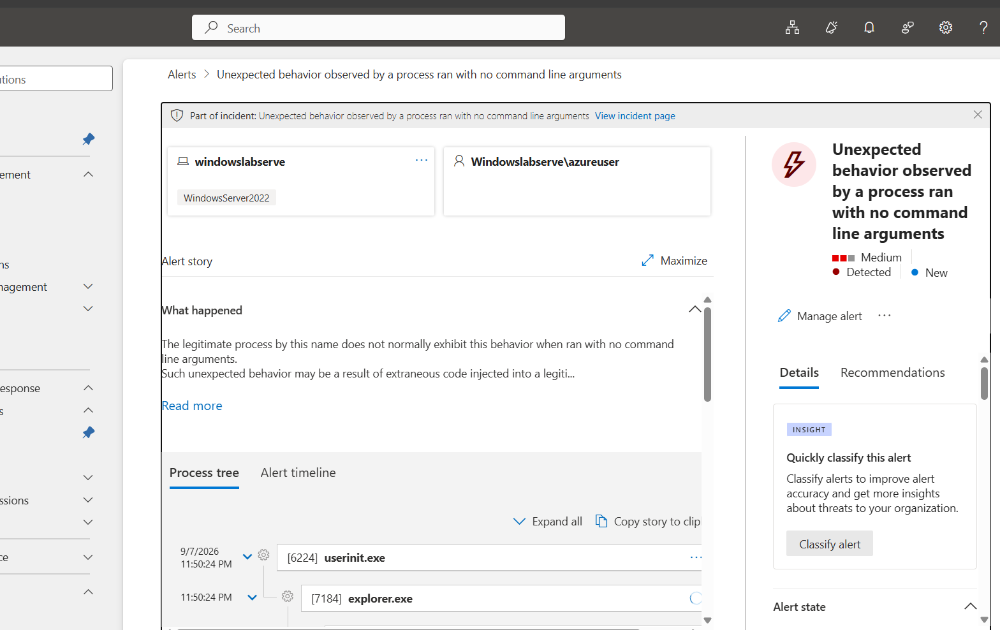

---

## 8. Microsoft Defender Live Response

Used Microsoft Defender Live Response to establish a remote investigation session with the Windows Server.

Live Response provides security analysts with a remote shell that can be used to investigate endpoints, collect information, and perform response actions.

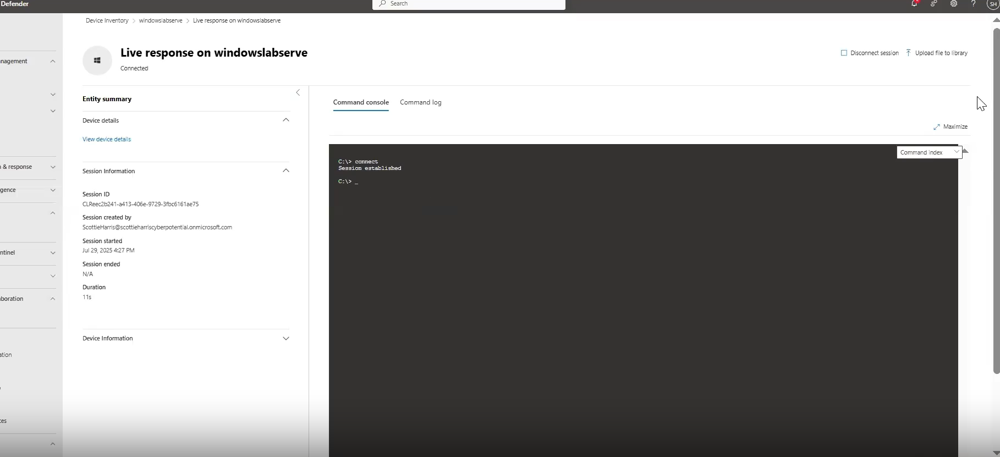

---

## 9. KQL Failed Logon Analysis

Used Kusto Query Language (KQL) in Azure Log Analytics to investigate failed Windows authentication activity.

The query extracted information including:

- Time generated
- Affected computer
- Failed account
- Source IP address
- Source port
- Logon type
- Failure reason

The results showed multiple failed logon attempts against the `azureuser` account from the same source IP address.

This demonstrated how KQL can be used to identify repeated authentication failures and investigate potentially suspicious login activity.

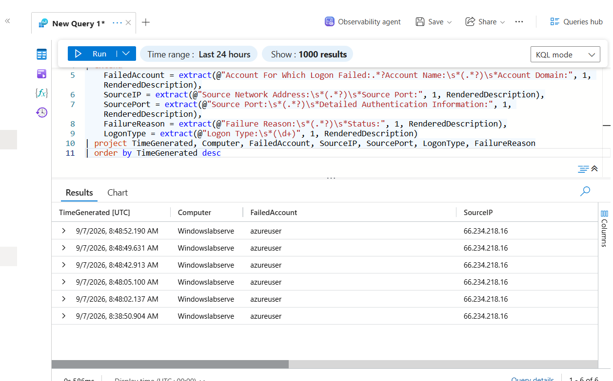

---

## Skills Demonstrated

- Endpoint Detection and Response (EDR)
- Security Alert Investigation
- Process Tree Analysis
- The Principle of Least Privilege (PoLP)
- Kusto Query Language (KQL)
- Azure Log Analytics
- Microsoft Entra ID
- Azure RBAC
- Identity and Access Management (IAM)
- Principle of Least Privilege
- Microsoft Defender Live Response

---

## What I Learned

This lab gave me hands-on experience with identity security, endpoint detection and response, log analysis, and SOC-style investigation workflows.

I learned how to create users, assign permissions based on least privilege, deploy and monitor a Windows endpoint, verify Microsoft Defender for Endpoint onboarding, generate controlled suspicious activity, review attack techniques, investigate a Defender alert, analyze process activity, use Live Response during an endpoint investigation, and use KQL to investigate failed authentication events.

The SOC investigation workflow demonstrated in this lab was:

**Generate suspicious activity → detect the alert → review the affected endpoint → analyze process activity → determine what triggered the detection → investigate using EDR tools → analyze supporting logs with KQL.**

---

## Disclaimer

This project was completed in a controlled educational lab environment. All attack simulation and security testing was performed on systems that I created and was authorized to use.
